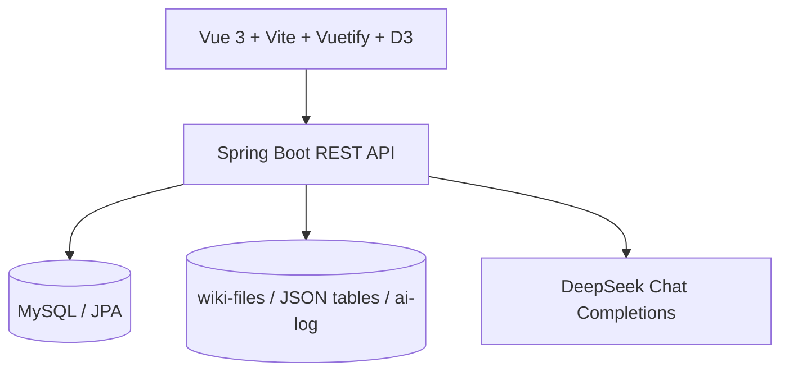
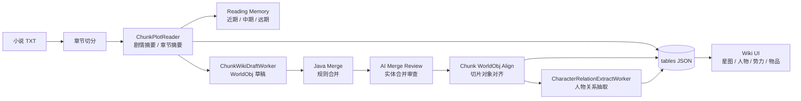

# txt2world

[English](README.md) | [中文](README-ZH.md)

> 上传一本小说 TXT，让 AI 自动构建人物、势力、物品与关系图谱 Wiki。

txt2world 是一个面向长篇小说的 **Narrative Knowledge System**。

它不是简单摘要工具，也不是只把小说切片后做 RAG 检索。它会模拟读者逐章阅读小说，在阅读过程中持续维护记忆、抽取世界对象、合并别名与身份信息，并最终把一本小说 TXT 转化为可浏览、可继续生长的世界模型。

你可以把它理解为：

```text
小说 TXT -> AI 阅读 -> 人物 / 势力 / 物品 -> 人物关系图谱 -> 小说 Wiki
```

## 效果展示

### 人物关系星图

随章节推进，人物关系星图逐渐生长。


### 上传与解析


## 当前能演示什么

- 上传小说 TXT，创建 Wiki 项目并异步解析。
- 按章节 chunk 阅读小说，生成切片摘要与章节摘要。
- 抽取人物、势力、物品等 WorldObj。
- 识别人物别名、身份特征、出场章节、生命状态。
- 增量合并 Wiki 对象，保留不同 chunk 的剧情摘要。
- 抽取人物关系，并展示为可缩放、可拖拽的人物关系星图。
- 查看人物详情、关系详情、人物 / 物品 / 势力卡片列表。
- 保存解析过程中的结构化 JSON 与 AI 调用日志，方便调试 Prompt Pipeline。

## 特色

- 即使是上千章的小说，人物角色经历若干个别名，仍能稳定识别人物，并且稳定到一个对象上。
- 核心人物关系稳定抽出。
- 章节摘要具有上下文连续性。

## 核心功能

- **TXT 上传与项目管理**：管理多个小说 Wiki 项目。
- **章节切分与 chunk 阅读**：按固定章节范围逐段解析长篇小说。
- **阅读记忆维护**：近期记忆、中期记忆、远期记忆分层压缩。
- **剧情摘要生成**：同时生成 chunkSummary 与 chapterSummary。
- **WorldObj 抽取**：统一抽取人物、势力、物品等小说世界对象。
- **别名与实体合并**：通过 aliases、identInfos 与 AI 合并审查降低重复实体。
- **人物关系抽取**：提取态度、层级、好感、纽带、叙事角色等关系维度。
- **人物关系星图**：用 D3 + SVG 展示人物节点、关系连线、缩放、平移与拖拽。
- **结构化 Wiki 浏览**：以页面形式浏览人物、势力、物品与关系信息。

## 为什么不是普通摘要 / RAG

普通长文本方案通常关注“把文本压短”或“从文本中检索答案”：

| 普通摘要 / RAG | txt2world |
| --- | --- |
| 输出一段摘要 | 输出可浏览的世界对象与关系 |
| 关注问答命中 | 关注小说世界的结构化沉淀 |
| 切片之间容易丢上下文 | 维护分层阅读记忆 |
| 很难处理人物别名和身份变化 | 使用 identInfos、aliases 和合并审查 |
| 更像资料检索 | 更像 AI 读者逐章做 Wiki |


## 核心理念

### WorldObj

WorldObj 是小说世界对象的统一模型。

人物、势力、物品都可以被抽象成 WorldObj，并带有：

- name：标准名称
- aliases：别名
- identInfos：身份识别信息
- importanceLevel：重要级别
- summary / chunkSummaryList：全局摘要与分 chunk 剧情
- lifeStatus：人物生命状态

### Reader-like Parsing

txt2world 不假设模型一次性全知全能。

它会把小说按章节 chunk 拆开，让模型像真实读者一样逐段阅读：先理解当前剧情，再结合已有记忆更新 Wiki。

### Incremental Wiki Building

每个 chunk 都会产生一批局部 WorldObj 草稿。系统会把这些草稿与已有 Wiki 数据合并，再让 AI 做实体合并审查，逐步构建更稳定的小说 Wiki。

### 叙事记忆压缩

长篇小说不能只靠单次上下文窗口。

项目中维护了近期记忆、中期记忆、远期记忆，并在字符数接近阈值时触发压缩，把旧剧情压缩为更高层次的叙事记忆。

### 人物识别与别名合并

小说人物经常存在称呼变化、身份隐藏、代号、尊称和翻译差异。

txt2world 使用 identInfos 与 aliases 辅助判断“这是不是同一个人”，减少同一角色被拆成多个条目的问题。

## 技术架构

- **Backend**：Spring Boot 2.5 / Java 8
- **Frontend**：Vue 3 / Vite / Vuetify / D3.js
- **Database**：MySQL / Spring Data JPA
- **AI**：DeepSeek Chat Completions API
- **Storage**：`wiki-files/wiki-{WikiProjectId}` 本地结构化文件



### 解析流水线



## 数据模型简介

- **WikiProject**：一次小说上传与解析任务。
- **ChunkSummary**：chunk 摘要与章节摘要。
- **ChunkReadingMemory**：近期 / 中期 / 远期阅读记忆。
- **WorldObj**：人物、势力、物品等统一世界对象。
- **MergedWikiData**：合并后的 Wiki 数据。
- **CharacterRelation**：两个人物之间在某个 chunk 内的关系。
- **RelationDimensions**：态度、层级、纽带、叙事角色等关系维度。

解析结果会落盘到：

```text
wiki-files/
  wiki-{WikiProjectId}/
    original.txt
    ai-log/
    tables/
```

其中 `tables/` 下保存了前端展示 Wiki 所需的结构化 JSON。


## 快速开始、Docker Compose 部署

### 1. 设置deepseek API key

如果只是想看看效果项目，则可以不填，项目已经预置了小说《诡秘之主》解析生成的Wiki。

如果想自己上传txt解析生成wiki，则需要deepseek API key，编辑 `.env`：

```env
AI_DEEPSEEK_API_KEY=your_deepseek_api_key
```

注意：txt解析并生成Wiki需要比较长的时间。

### 2. 打包

```bash
mvn package
```

### 3. 启动

```bash
docker compose --env-file .env up -d --build
```

访问：

```text
http://localhost:49600
```

## Roadmap

- [x] TXT 上传与 Wiki 项目创建
- [x] 异步解析任务
- [x] 小说章节切分
- [x] chunkSummary / chapterSummary 生成
- [x] 分层阅读记忆与记忆压缩
- [x] 人物 / 势力 / 物品抽取
- [x] 别名、身份信息与实体合并
- [x] 人物关系抽取
- [x] D3 人物关系星图
- [x] 人物 / 物品 / 势力列表展示
- [x] 基础人物详情与关系详情
- [ ] 更完整的人物详情页
- [ ] 多模型适配

## 适合什么人

- 想用 AI 分析长篇小说的人
- 想做小说 Wiki / 世界观整理工具的人
- 想研究大模型长文本解析的人
- 想研究 AI Agent / Prompt Pipeline / 知识图谱应用的人
- 想给自己的小说或网文作品生成Wiki的人
- 想学习 Spring Boot + Vue + D3 实战项目的人

## 参与开发

欢迎通过 Issue 和 PR 参与：

- 改进 Prompt，使抽取结果更稳定。
- 完善人物、势力、物品详情页。
- 等等

建议提交 PR 前先说明你要解决的问题，避免和已有开发方向冲突。

## 开源协议

本项目使用 [Apache License 2.0](LICENSE)。

## Star

如果你对“AI 阅读小说并构建世界模型”这个方向感兴趣，欢迎 Star、Issue 和 PR。
