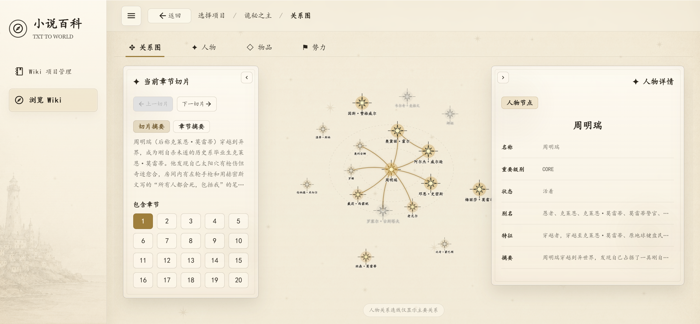
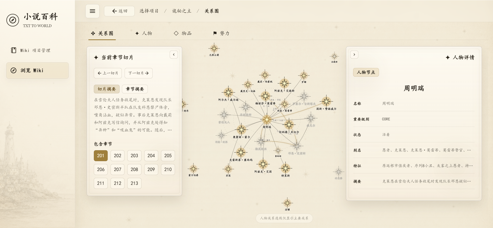
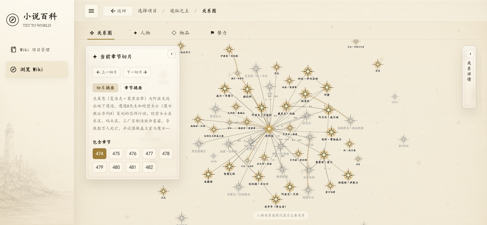
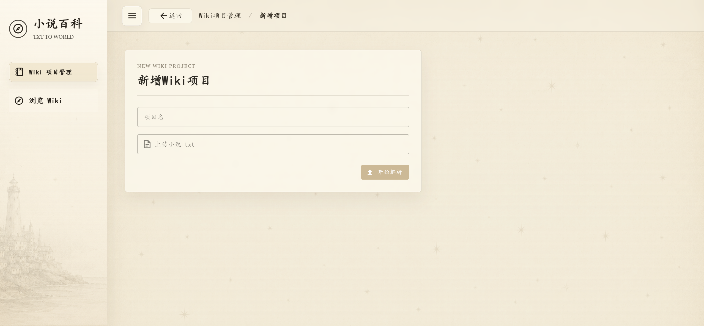
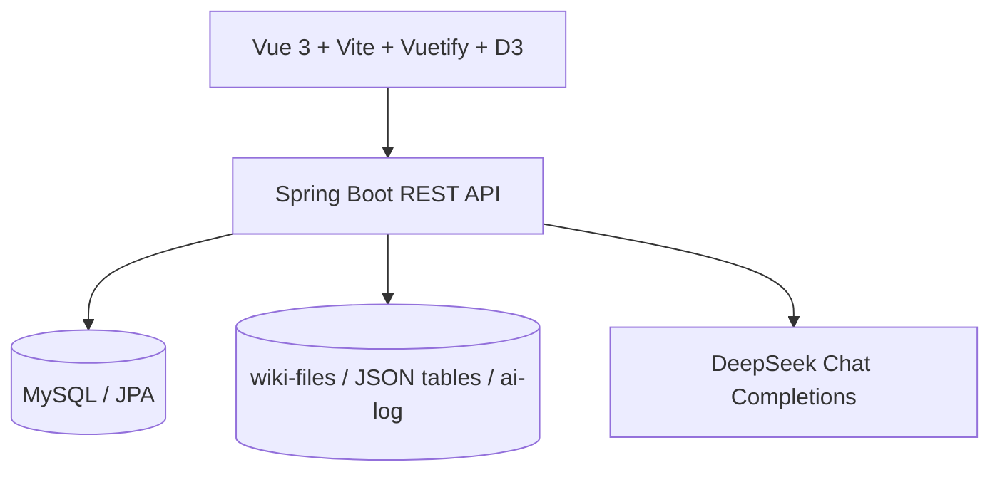
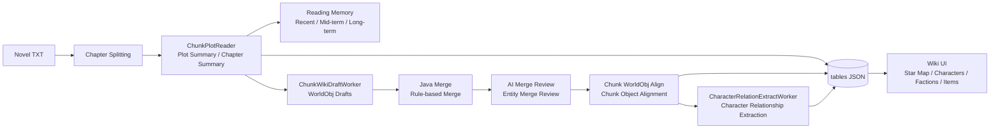

# txt2world

> Upload a novel TXT file, and let AI automatically build a Wiki of characters, factions, items, and relationship graphs.

txt2world is a **Narrative Knowledge System** for long-form fiction.

It is not a simple summarizer, and it is not just RAG over sliced novel chapters. It reads a novel chunk by chunk like a reader, continuously maintains narrative memory, extracts world objects, merges aliases and identity clues, and finally turns a TXT novel into a browsable and extensible world model.

You can think of it as:

```text
Novel TXT -> AI Reading -> Characters / Factions / Items -> Character Relationship Graph -> Novel Wiki
```

## Demo

### Character Relationship Star Map

As chapters progress, the relationship graph grows over time.







### Upload and Parse



## What Can Be Demoed Now

- Upload a novel TXT file, create a Wiki project, and parse it asynchronously.
- Read the novel by chapter chunks and generate both chunk summaries and chapter summaries.
- Extract WorldObj entries such as characters, factions, and items.
- Identify character aliases, identity clues, appearance chapters, and life status.
- Incrementally merge Wiki objects while preserving per-chunk plot summaries.
- Extract character relationships and visualize them as a zoomable, draggable star map.
- View character details, relationship details, and card lists for characters, items, and factions.
- Persist structured JSON and AI call logs for debugging the prompt pipeline.

## Highlights

- Even in novels with more than a thousand chapters, characters can remain stable across aliases and identity changes.
- Core character relationships can be extracted consistently.
- Chapter summaries preserve narrative continuity across chunks.

## Core Features

- **TXT Upload and Project Management**: Manage multiple novel Wiki projects.
- **Chapter Splitting and Chunk Reading**: Parse long novels by fixed chapter ranges.
- **Reading Memory**: Maintain recent, mid-term, and long-term memory with hierarchical compression.
- **Plot Summary Generation**: Generate both `chunkSummary` and `chapterSummary`.
- **WorldObj Extraction**: Extract characters, factions, items, and other novel world objects using a unified model.
- **Alias and Entity Merging**: Use `aliases`, `identInfos`, and AI merge review to reduce duplicate entities.
- **Character Relationship Extraction**: Extract dimensions such as attitude, hierarchy, favorability, bond, and narrative role.
- **Character Relationship Star Map**: Use D3 + SVG to render character nodes, relationship lines, zooming, panning, and dragging.
- **Structured Wiki Browsing**: Browse characters, factions, items, and relationship information in the UI.

## Why Not Just Summarization or RAG

Most long-text solutions focus on “making text shorter” or “retrieving answers from text”.

| Summarization / RAG | txt2world |
| --- | --- |
| Outputs a text summary | Outputs browsable world objects and relationships |
| Focuses on QA hits | Focuses on structured accumulation of the fictional world |
| Context is easily lost between chunks | Maintains layered reading memory |
| Hard to handle aliases and identity changes | Uses `identInfos`, `aliases`, and merge review |
| Feels like document retrieval | Feels like an AI reader building a Wiki chapter by chapter |

## Core Ideas

### WorldObj

WorldObj is the unified model for objects in a fictional world.

Characters, factions, and items can all be represented as WorldObj entries with:

- `name`: canonical name
- `aliases`: aliases
- `identInfos`: identity clues
- `importanceLevel`: importance level
- `summary / chunkSummaryList`: global summary and per-chunk plot history
- `lifeStatus`: character life status

### Reader-like Parsing

txt2world does not assume the model is omniscient in one pass.

It splits the novel into chapter chunks and lets the model read progressively like a real reader: understand the current plot first, then update the Wiki with existing memory.

### Incremental Wiki Building

Each chunk produces local WorldObj drafts. The system merges these drafts with existing Wiki data, then asks AI to review entity merges, gradually building a more stable novel Wiki.

### Narrative Memory Compression

Long novels cannot rely on a single context window.

The project maintains recent, mid-term, and long-term memory. When character count approaches configured thresholds, older plot information is compressed into higher-level narrative memory.

### Character Identification and Alias Merging

Novel characters often have changing names, hidden identities, code names, titles, honorifics, and translation variations.

txt2world uses `identInfos` and `aliases` to help determine whether entries refer to the same character, reducing the chance of splitting one character into multiple Wiki pages.

## Technical Architecture

- **Backend**: Spring Boot 2.5 / Java 8
- **Frontend**: Vue 3 / Vite / Vuetify / D3.js
- **Database**: MySQL / Spring Data JPA
- **AI**: DeepSeek Chat Completions API
- **Storage**: local structured files under `wiki-files/wiki-{WikiProjectId}`



### Parsing Pipeline



## Data Model Overview

- **WikiProject**: one novel upload and parsing task.
- **ChunkSummary**: chunk summary and chapter summaries.
- **ChunkReadingMemory**: recent / mid-term / long-term reading memory.
- **WorldObj**: unified world object model for characters, factions, and items.
- **MergedWikiData**: merged Wiki data.
- **CharacterRelation**: relationship between two characters within a chunk.
- **RelationDimensions**: relationship dimensions such as attitude, hierarchy, bond, and narrative role.

Parsing results are persisted to:

```text
wiki-files/
  wiki-{WikiProjectId}/
    original.txt
    ai-log/
    tables/
```

The `tables/` directory stores the structured JSON used by the frontend Wiki views.

## Quick Start with Docker Compose

### 1. Set DeepSeek API Key

If you only want to try the demo, you can leave this empty. The project already includes a pre-parsed demo Wiki project for *Lord of the Mysteries*.

If you want to upload your own TXT file and parse a new Wiki, edit `.env`:

```env
AI_DEEPSEEK_API_KEY=your_deepseek_api_key
```

Note: parsing a TXT novel and generating a Wiki can take a long time.

### 2. Package

```bash
mvn package
```

### 3. Start

```bash
docker compose --env-file .env up -d --build
```

Open:

```text
http://localhost:49600
```

## Roadmap

- [x] TXT upload and Wiki project creation
- [x] Asynchronous parsing task
- [x] Novel chapter splitting
- [x] `chunkSummary` / `chapterSummary` generation
- [x] Layered reading memory and memory compression
- [x] Character / faction / item extraction
- [x] Alias, identity information, and entity merging
- [x] Character relationship extraction
- [x] D3 character relationship star map
- [x] Character / item / faction list views
- [x] Basic character details and relationship details
- [ ] More complete character detail pages
- [ ] Multi-model support

## Who Is This For

- People who want to use AI to analyze long-form fiction.
- Builders of novel Wiki or worldbuilding organization tools.
- Developers researching long-context parsing with LLMs.
- Developers interested in AI agents, prompt pipelines, and knowledge graph applications.
- Writers who want to generate a Wiki for their own fiction.
- Developers who want to learn from a Spring Boot + Vue + D3 project.

## Contributing

Issues and PRs are welcome.

Good areas to contribute:

- Improve prompts to make extraction more stable.
- Improve character, faction, and item detail pages.
- Add more model providers.
- Improve deployment and documentation.

Before opening a PR, it is recommended to describe the problem you want to solve first, so the work does not conflict with the existing direction.

## License

This project is licensed under the [Apache License 2.0](LICENSE).

## Star

If you are interested in “AI reading novels and building world models”, stars, issues, and PRs are welcome.
